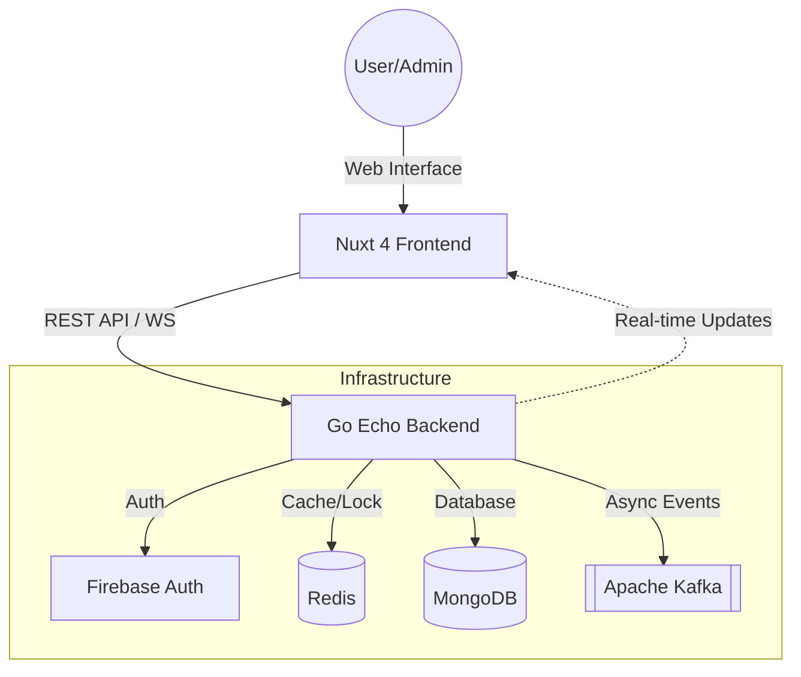

# MovieTicket Booking System

ระบบจองตั๋วหนังแบบ Real-time พัฒนาด้วย Go, Nuxt 4

---

## 1. System Architecture Diagram
สถาปัตยกรรมของระบบถูกออกแบบมาให้รองรับการทำงานแบบ Microservices-ready โดยแบ่งส่วนการทำงานดังนี้:



---

## 2. Tech Stack Overview
### Frontend
- **Nuxt 4 (TypeScript)**
- **Nuxt UI & Tailwind v4**: เพื่อความสะดวกในการ Styling
- **Firebase Auth (Client)**: จัดการ Login/Register และ Session ของผู้ใช้
- **WebSockets**: ใช้สำหรับการอัปเดตสถานะที่นั่งแบบ Real-time

### Backend
- **Go (Echo Framework)**
- **Firebase Admin SDK**: ตรวจสอบ JWT Token และจัดการสิทธิ์ผู้ใช้จากฝั่ง Server
- **MongoDB**: จัดการ User Profiles, Movie List และ Booking History
- **Redis**: ทำ Distributed Locking และ Temporary State Management
- **Apache Kafka**: ระบบ Message Queue สำหรับประมวลผล Booking Events แบบ Asynchronous

---

## 3. Booking Flow (Step-by-Step)
กระบวนการจองตั๋วถูกออกแบบมาเพื่อป้องกันการจองซ้ำ (Double Booking):
1. **Browse**: ผู้ใช้เลือกภาพยนตร์และรอบฉาย
2. **Seat Selection**: 
    - เมื่อผู้ใช้คลิกเลือกที่นั่ง ระบบจะส่ง Request ไปที่ Backend เพื่อ **Lock ที่นั่งใน Redis** เป็นเวลา 5 seconds
    - สถานะที่นั่งจะถูก Broadcast ผ่าน **WebSockets** ให้ผู้ใช้คนอื่นเห็นทันที (เป็นสีส้ม/Locked)
3. **Payment**: ผู้ใช้กรอกข้อมูลบัตรเครดิต (จำลอง) และกดยืนยัน
4. **Validation & Finalize**: 
    - Backend ตรวจสอบว่าที่นั่งยังถูก Lock โดยผู้ใช้คนเดิมหรือไม่
    - หากถูกต้อง ระบบจะบันทึกข้อมูลลง **MongoDB** และปลด Lock ใน Redis
5. **Event Notification**: Backend ส่ง Event `BOOKING_CONFIRMED` เข้าไปยัง **Kafka** เพื่อประมวลผลต่อ (เช่น ส่ง Log หรือเก็บสถิติ)

---

## 4. Redis Lock Strategy
เราใช้ Redis ในการทำ **Distributed Lock** เพื่อจัดการสิทธิ์การเข้าถึงที่นั่งชั่วคราว:
- **Command**: ใช้ `SETNX` (Set if Not Exists) เพื่อให้มั่นใจว่าจะมีแค่ "คนแรก" เท่านั้นที่ Lock ที่นั่งได้
- **Key Pattern**: `lock:{movieID}:{showtime}:{seatNumber}`
- **TTL (Time-To-Live)**: ตั้งเวลาไว้ 5 seconds หากผู้ใช้ไม่จองให้เสร็จภายในเวลานี้ ที่นั่งจะถูกคลาย Lock อัตโนมัติ เพื่อให้โอกาสผู้ใช้คนอื่น

---

## 5. Message Queue ใช้ทำอะไร?
ในโปรเจกต์นี้เรานำ **Apache Kafka** มาใช้เพื่อแยกส่วนการทำงาน (Decoupling):
- **Reliability**: เมื่อมีการจองสำเร็จ เราจะส่ง Message เข้า Kafka ทันที เพื่อให้ระบบ Log หรือระบบประมวลผลอื่นๆ ทำงานต่อได้โดยไม่ทำให้ User ต้องรอ (Asynchronous)
- **Scalability**: ในอนาคตหากมีระบบอื่นเพิ่มเข้ามา (เช่น ระบบส่ง Email หรือ Loyalty Points) ก็สามารถมา Subscribe จาก Kafka Topic เดียวกันได้เลย

---

## 6. วิธีรันระบบ (Setup & Installation)

### Prerequisites
- Docker & Docker Desktop
- Go 1.21+
- Node.js (v18+) & pnpm

### Step 1: Start Infrastructure
```bash
docker compose up -d
```
*ระบบจะรัน MongoDB, Redis และ Kafka พร้อมโหลดข้อมูลเริ่มต้น (Seed Data) จาก `mongo-init.js`*

### Step 2: Backend Setup
1. เตรียมไฟล์ `serviceAccountKey.json` จาก Firebase Console ไว้ในโฟลเดอร์ `backend/`
2. รันคำสั่ง:
```bash
cd backend
go run main.go
```

### Step 3: Frontend Setup
1. สร้างไฟล์ `frontend/.env` โดยคัดลอกรูปแบบจาก `.env.example`
2. รันคำสั่ง:
```bash
cd frontend
pnpm install
pnpm dev
```

---

## 7. Assumptions & Trade-offs
- **Assumptions**: ระบบสมมติว่าผู้ใช้ทุกคนมี Firebase Account และระบบชำระเงินทำงานผ่านระบบจำลอง (Simulation)
- **Trade-off (WebSockets vs Polling)**: เลือกใช้ WebSockets เพื่อความ Real-time สูงสุด แม้ว่าจะมีความซับซ้อนในการจัดการ Connection มากกว่าการทำ Polling
- **Trade-off (MongoDB vs Relational)**: เลือก MongoDB เพื่อความคล่องตัวในการปรับเปลี่ยน Schema ของข้อมูลภาพยนตร์ (เช่น เพิ่มฟีเจอร์ Genre, Trailer URL ได้ง่าย) แต่แลกมาด้วยการต้องจัดการ Data Consistency ระหว่าง Collection ด้วยตัวเอง (เช่น User ID ใน Booking)
